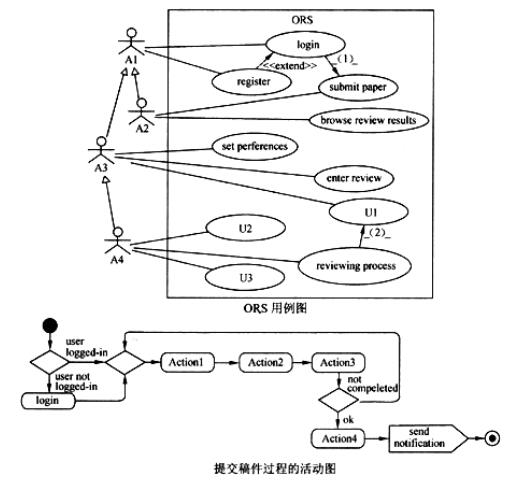

# 软件工程-q-000952

## 题目

阅读下列说明和图，回答问题1至问题4，将解答填入对应栏内。
【说明】
    在线会议审稿系统(Online Reviewing System，ORS)主要处理会议前期的投稿和审稿事务，其功能描述如下：
    1．用户（User）在初始使用系统时，必须在系统中注册(register)成为作者（Author）或审稿人（Reviewer）。
    2．作者登录(login)后提交稿件（submit paper）和浏览稿件审阅结果（browse review results）。提交稿件必须在规定提交时间范围内，其过程为先输入标题和摘要（enter title and abstract）、选择稿件所属主题类型（select subject group ）、选择稿件所在位置 (存储位置)（select paper location）。上述几步若未完成，则重复；若完成，则上传稿件至数据库中（upload paper ），系统发送通知（send notification ）。
    3．审稿人登录后可设置兴趣领域（set preferences ）、审阅稿件给出意见（enter review ）以及罗列录用和(或)拒绝的稿件（List accepted/rejected papers）。
    4．会议委员会主席（PCChair）是一个特殊审稿人，可以浏览提交的稿件（browse　　　　　submitted papers）、给审稿人分配稿件（assign paper to reviewer ）、罗列录用和(或)拒绝的稿件以及关闭审稿过程（close reviewing process）。其中，关闭审稿过程须包括罗列录用和(或)拒绝的稿件。
系统采用面向对象方法开发，使用UML进行建模。
　　系统的部分用例图和提交稿件的活动图分别见下图。

11

【问题4】（4分）
根据[说明]中的描述，使用用例名称列表和活动名称列表中的英文名称，给出提交稿件过程的活动图中Actionl～Action4对应的活动。

