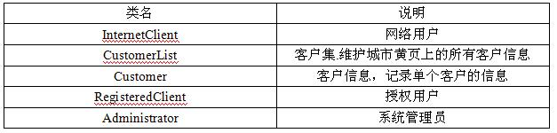
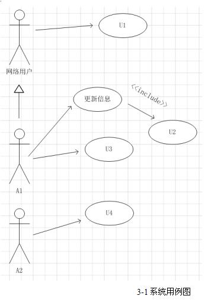
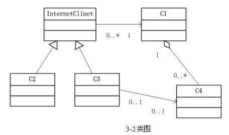

# 软件工程-q-000953

## 题目

试题三（15分）
某城市拟开发一个基于Web的城市黄页，公开发布该城市重要的组织或机构(以下统称为客户)的基本信息，方便城市生活。该系统的主要功能描述如下：
（1）搜索信息：任何使用Internet的网络用户都可以搜索发布在城市黄页中的信息，例如客户的名称、地址、联系电话等。
（2）认证：客户若想在城市黄页上发布信息，需通过系统的认证。认证成功后，该客户成为系统授权用户。
（3）更新信息：授权用户登录系统后，可以更改自己在城市黄页中的相关信息，例如变更联系电话等。
（4）删除客户：对于拒绝继续在城市黄页上发布信息的客户，有系统管理员删除该客户的相关信息。
系统采用面向对象方法进行开发，在开发过程中认定出如下表所示的类。系统的用例图和类图分别如图1和图2所示。

【问题1】（6分）
根据[说明]中的描述，写出参与者和用例名称（中文即可）。

