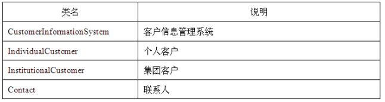
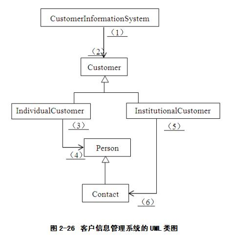

# 软件工程-q-000956

## 题目

【试题三】（15分）某客户信息管理系统中保存着两类客户的信息：
（1）个人客户。对于这类客户，系统保存了其客户标识（由系统生成）和基本信息（包括姓名、住宅电话和E-mail）。
（2）集团客户。集团客户可以创建和管理自己的若干名联系人。对于这类客户，系统除了保存其客户标识（由系统生成）之外，也保存了其联系人的信息。联系人的信息包括姓名、住宅电话、E-mail、办公电话以及职位。
该系统除了可以保存客户信息之外，还具有以下功能：
（1）向系统中添加客户（addCustomer）；
（2）根据给定的客户标识，在系统中查找该客户（getCustomer）；
（3）根据给定的客户标识，从系统中删除该客户（removeCustomer）；
（4）创建新的联系人（addContact）；
（5）在系统中查找指定的联系人（getContact）；
（6）从系统中删除指定的联系人（removeContact）。
该系统采用面向对象方法进行开发。在面向对象分析阶段，根据上述描述，得到如表2-5所示的类。
表2-5 得到的各种类

类名说明
CustomerInformationSystem客户信息管理系统
IndividualCustomer个人客户
InstitutionalCustomer集团客户
Contact联系人
描述该客户信息管理系统的UML类图如图2-26所示。

【问题1】
请使用说明中的术语，给出图2-26中类Customer和类Person的属性。

