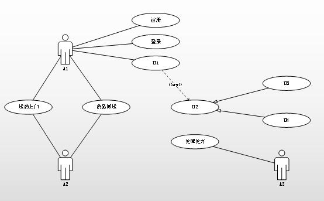
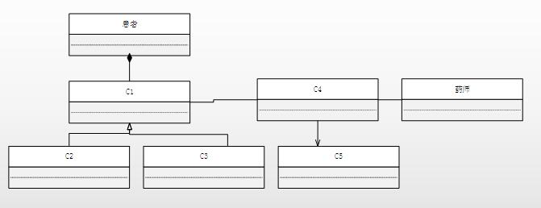

# 软件工程-q-000958

## 题目

案例三（15分）
阅读下列说明和图，回答问题1至问题3，将解答填入答题纸的对应栏内。
【说明】
某中医医院拟开发一套线上抓药APP，允许患者凭借该医院医生开具的处方线上抓药，并提供免费送药上门服务。该系统的主要功能描述如下：
（1）注册。患者扫描医院提供的二维码进行注册，注册过程中，患者需提供其病历号，系统根据病历号自动获取患者基本信息。
（2）登录。已注册的患者可以登录系统进行线上抓药，未注册的患者系统拒绝其登录。
（3）确认处方。患者登录后，可以查看医生开具的所有处方。患者选择需要抓药的处方和数量（需要抓几副药），同时说明是否需要煎制。选择取药方式：自行到店取药或者送药上门，若选择送药上门，患者需要提供收货人姓名、联系方式和收货地址。系统自动计算本次抓药的费用，患者可以使用微信或支付宝等支付方式支付费用。支付成功之后，处方被发送给药师进行药品配制。
（4）处理处方。药师根据处方配制好药品。若患者要求煎制，药师对配制好的药品进行煎制。煎制完成，药师将该处方设置为已完成。若患者选择的是自行取药，取药后确认已取药。
（5）药品派送。处方完成后，对于选择送药上门的患者，系统将给快递人员发送药品配送信息，等待快递人员取药；并给患者发送收货验证码。
（6）送药上门。快递人员将配制好的药品送到患者指定的收货地址。患者收货时，向快递人员出示收货验证码，快递人员使用该验证码确认药品已送到。
现采用面向对象分析与设计方法开发上述系统，得到如图3-1所示的用例图以及图3-2所示的类图。

【问题2】（5分）
根据说明中的描述，给出图 3-2中 C1~C5 所对应的类名。

