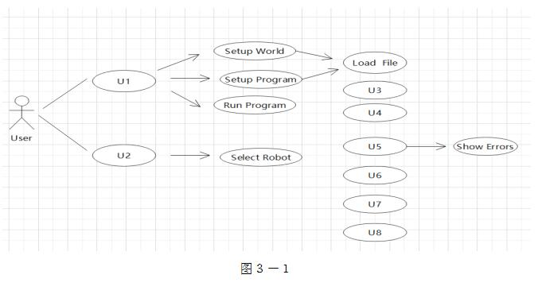
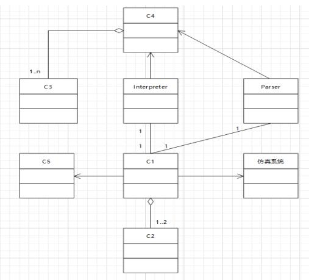

# 软件工程-q-000961

## 题目

阅读下列说明和图，回答问题1至问题3，将解答填入答题纸的对应栏内。
【说明】
    某软件公司欲设计实现一个虚拟世界仿真系统。系统中的虚拟世界用于模拟现实世界中的不同环境（由用户设置并创建），用户通过操作仿真系统中的 1～2 个机器人来探索虚拟世界。机器人维护着两个变量 b1 和 b2，用来保存从虚拟世界中读取的字符。
    该系统的主要功能描述如下：
    （1）机器人探索虚拟世界（Run Robots）。用户使用编辑器（Editor）编写文件以设置想要模拟的环境，将文件导入系统（Load File）从而在仿真系统中建立虚拟世界（Setup World）。机器人在虚拟世界中的行为也在文件中进行定义，建立机器人的探索行为程序（Setup Program）。机器人在虚拟世界中探索时（Run Program），有2种运行模式：
    ①自动控制（Run）：事先编排好机器人的动作序列（指令（Instruction）），执行指令，使机器人可以连续动作。若干条指令构成机器人的指令集（Instruction Set）。
    ②单步控制（Step）：自动控制方式的一种特殊形式，只执行指定指令中的一个动作。
    （2）手动控制机器人（Manipulate Robots）。选定1个机器人后（Select Robot），可以采用手动方式控制它。手动控制有4种方式：
    ①Move：机器人朝着正前方移动一个交叉点。
    ②Left：机器人原地沿逆时针方向旋转90度。
    ③Read：机器人读取其所在位置的字符，并将这个字符的值赋给b1；如果这个位置上没有字符，则不改变b1的当前值。
    ④Write：将b1中的字符写入机器人当前所在的位置，如果这个位置上已经有字符，该字符的值将会被b1的值替代。如果这时b1没有值，即在执行Write动作之前没有执行过任何Read动作，那么需要提示用户相应的错误信息（Show Errors）。
    手动控制与单步控制的区别在于，单步控制时执行的是指令中的动作，只有一种控制方式，即执行下个动作；而手动控制时有4种动作。
    现采用面向对象方法设计并实现该仿真系统，得到如图3-1所示的用例图和图3-2所示的初始类图。图3-2中的类“Interpreter”和“Parser”用于解析描述虚拟世界的文件以及机器人行为文件中的指令集。

【问题3】（5分）
    根据说明中的描述，给出图3-2中C1～C5所对应的类名。

