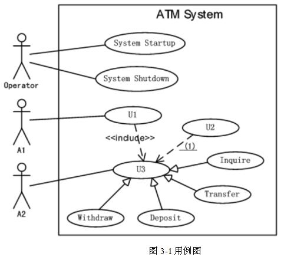
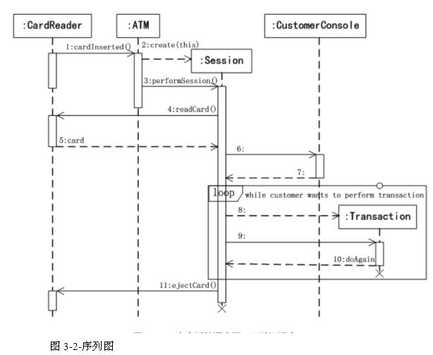
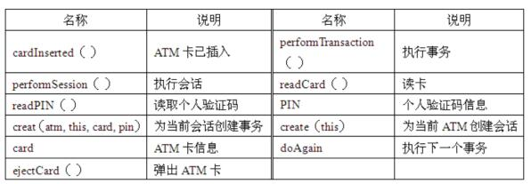

# 软件工程-q-000963

## 题目

试题三（18分）
[说明]
某银行计划开发一个自动存提款机模拟系统(ATM System)。系统通过读卡(CardReader)
读取ATM卡；系统与客户(Customer)的交互由客户控制台(Customer-Console)实现；银
行操作员(Operator)可控制系统的启动(System Startup)和停止(System Shutdown)：系统
通过网络和银行系统(Bank)实现通信。
当读卡器判断用户已将ATM卡插入后，创建会话(Session)。会话开始后，读卡器进行读卡，并要求客户输入个人验证码(PIN)。系统将卡号和个人验证码信息送到银行系统进行验证。验证通过后，客户可从菜单选择如下事务(Transaction)：
1．从ATM卡账户取款(Withdraw)；
2．向ATM卡账尸存款(Deposit)；
3．进行转账(Transfer)：
4．查询(Inquire)ATM卡账户信息。
一次会话可以包含多个事务，每个事务处理也会将卡号和个人验证码信息送到银行系统
进行验证。若个人验证码错误，则转个人验证码错误处理(Invalid PIN Process)。每个事务完成后，客户可选择继续上述事务或退卡。选择退卡时，系统弹出ATM卡，会话结束。     系统采用面向对象方法开发，使用UML进行建模。系统的顶层用例图如图3-1所示，一次会话的序列图(不考虑验证)如图3-2所示。

【问题2】（8分）
根据[说明]中的描述，使用消息名称列表中的英文名称，给出图3-2中6～9对应的消息。
消息名称参见下表。

