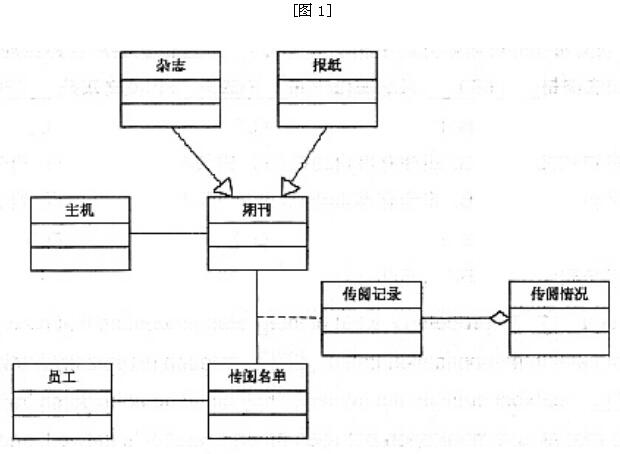
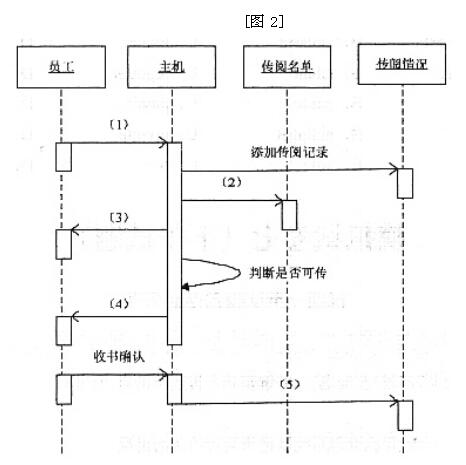

# 软件工程-q-000965

## 题目

试题三（16分）
阅读下列说明和图，回答下面问题。
    [说明]
    公司IT部门决定开发一个计算机管理系统以记录期刊的传阅情况。
    期刊在公司内部传阅，员工可以要求加入传阅队列。图书室登记公司收到的期刊，交给名单中的第一名员工。员工应在三个工作日内完成阅读，员工阅读完毕后通知系统，系统提醒下一位阅读者取书，下一个员工必须确认已收到期刊。当传阅名单中“下一位”员工出差在外时将无法进行传阅，此时将期刊传给再下一位，并将该员工标记；再次传递此书时优先考虑该员工。最后一位员工阅读完毕后，将期刊交还图书室以便共用。系统能在员工忘记传递期刊时发出提醒信息。系统详细记录期刊传阅情况，当员工阅读完后通知系统，系统记录该员工号及日期，并在备注栏注明是传出；同样，当员工收到期刊后向系统确认，系统记录该员工号及日期，并在备注栏注明是收到。
    公司的员工都有一个唯一的员工号。公司订阅了多种期刊，为每一本期刊(有唯一期刊流水号)产生一份传阅名单，并详细记录传阅情况。员工的出差情况存储在系统主机中。
    该系统采用面向对象方法开发，系统中的类以及类之间的关系用UML类图表示，图1是该系统的类图的一部分，图2描述了成功传递期刊的序列图。

【问题一】根据题意，给出类“传阅记录”的主要属性。（5分）

