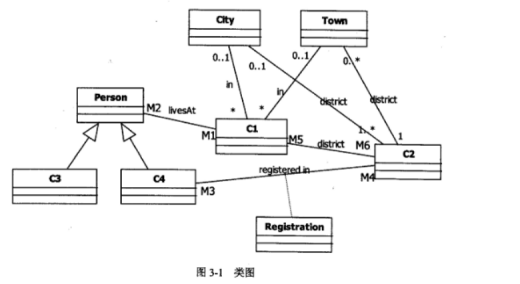

# 软件工程-q-000970

## 题目

试题三（共15分）
阅读下列说明和图，回答问题1至问题3．将解答填入答题纸的对应栏内。
【说明】
某公司欲开发一个管理选民信息的软件系统。系统的基本需求描述如下：
(1)每个人（Person）可以是一个合法选民(Eligible)或者无效的选民(Ineligible)。
(2)每个合法选民必须通过该系统对其投票所在区域(即选区，Riding)进行注册
(Registration)。每个合法选民仅能注册一个选区。
(3)选民所属选区由其居住地址(Address)决定。假设每个人只有一个地址，地址
可以是镇(Town)或者城市(City)。
(4)某些选区可能包含多个镇，而某些较大的城市也可能包含多个选区。
现采用面向对象方法对该系统进行分析与设计，得到如图3-1所示的初始类图。

【问题1】（8分）
根据说明中的描述，给出图3-1中C1-C4所对应的类名（类名使用说明中给出的
英文词汇）。

