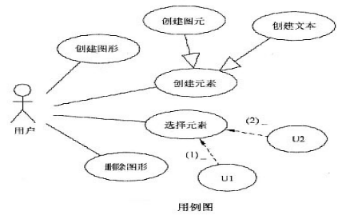
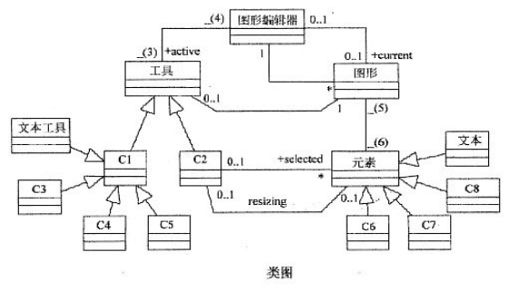

# 软件工程-q-000971

## 题目

试题三（共15分）
阅读下列说明和图，回答问题1至问题3，将解答填入对应栏内。
【说明】
一个简单的图形编辑器提供给用户的基本操作包括：创建图形、创建元素、选择元素以及删除图形。图形编辑器的组成及其基本功能描述如下：
（1）图形由文本元素和图元元素构成，图元元素包括线条、矩形和椭圆。
（2）图形显示在工作空间中，一次只能显示一张图形(即当前图形，current)。
（3）编辑器提供了两种操作图形的工具：选择工具和创建工具。对图形进行操作时，一次只能使用一种工具(即当前活动工具，active)。
创建工具用于创建文本元素和图元元素。
②对于显示在工作空间中的图形，使用选择工具能够选定其中所包含的元素，可以选择一个元素，也可以同时选择多个元素。被选择的元素称为当前选中元素(selected)。
 ③每种元素都具有对应的控制点。拖拽选定元素的控制点，可以移动元素或者调整元素的大小。
    现采用面向对象方法开发该图形编辑器，使用UML进行建模。构建出的用例图和类图分别如图3-1和图3-2所示。

【问题1】（4分）根据说明中的描述，给出图3-1中U1和U2所对应的用例，以及(1)和(2)处所对应的关系。

