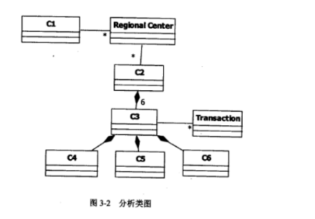

# 软件工程-q-000974

## 题目

试题三（15分）
 阅读下列说明，回答问题 1 至问题 3，将解答填入答题纸的对应栏内。
【说明】
某 ETC（Electronic Toll Collection，不停车收费）系统在高速公路沿线的特定位置上设置一个横跨道路上空的龙门架（Toll gantry），龙门架下包括 6 条车道（Traffic lanes），每条车道上安装有雷达传感器（Radar sensor）、无线传输器（Radio transceiver）和数码相机（Digital Camera）等用于不停车收费的设备，以完成正常行驶速度下的收费工作。该系统的基本工作过程如下：
（1）每辆汽车上安装有车载器，驾驶员（Driver）将一张具有唯一识别码的磁卡插入车载器中。磁卡中还包含有驾驶员账户的当前信用记录。
（2）当汽车通过某条车道时，不停车收费设备识别车载器内的特有编码，判断车型，
将收集到的相关信息发送到该路段所属的区域系统（Regional center）中，计算通行费用创建收费交易（Transaction），从驾驶员的专用账户中扣除通行费用。如果驾驶员账户透
支，则记录透支账户交易信息。区域系统再将交易后的账户信息发送到维护驾驶员账户信息
的中心系统（Central system）
（3）车载器中的磁卡可以使用邮局的付款机进行充值。充值信息会传送至中心系统，以更新驾驶员账户的余额。
（4）当没有安装车载器或者车载器发生故障的车辆通过车道时，车道上的数码相机将对车辆进行拍照，并将车辆照片及拍摄时间发送到区域系统，记录失败的交易信息；并将该交易信息发送到中心系统。
（5）区域系统会获取不停车收费设备所记录的交通事件（Traffic events）；交通广播电台（Traffic advice center）根据这些交通事件进行路况分析并播报路况。
现采用面向对象方法对上述系统进行分析与设计，得到如表 3－1 所示的用例列表以及如图 3－1 所示的用例图和图 3－2 所示的分析类图。

【问题 3】（6 分）
根据说明中的描述，给出图 3－2 中 C1~C6 所对应的类名。

