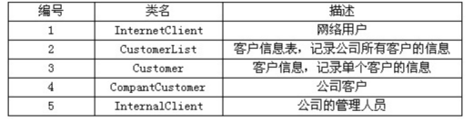

# 软件工程-q-000976

## 题目

试题三（16分）
【说明】
某电话公司决定开发一个管理所有客户信息的交互式网络系统。系统功能如下。
(1)浏览客户信息：任何使用Internet的网络用户都可以浏览电话公司所有的客户信息(包括姓名、住址、电话号码等)。
(2)登录：电话公司授予每个客户一个账号。拥有授权账号的客户，可以使用系统提供的页面设置个人密码，并使用该账号和密码向系统注册。
(3)修改个人信息：客户向系统注册后，可以发送电子邮件或者使用系统提供的页面，对个人信息进行修改。
(4)删除客户信息：只有公司的管理人员才能删除不再接受公司服务的客户的信息。系统采用面向对象方法进行开发，在开发过程中认定出的类见下表。

【问题 2】（8 分）
（1）在面向对象建模中，类的关系有几种？分别是什么？
（2）用例的关系有几种？分别是什么？

