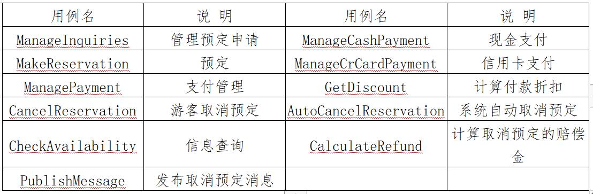
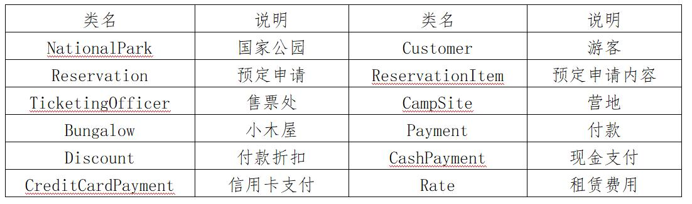
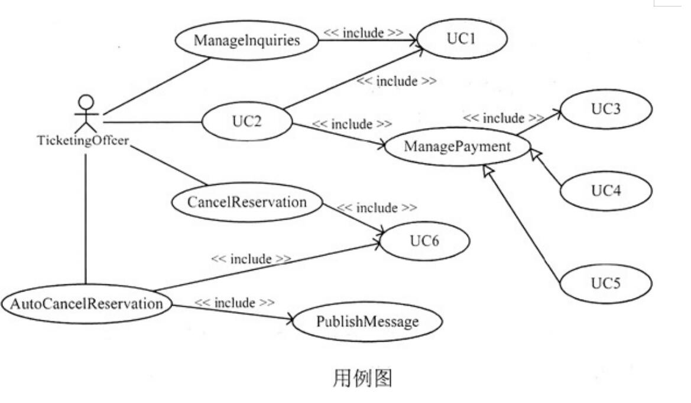
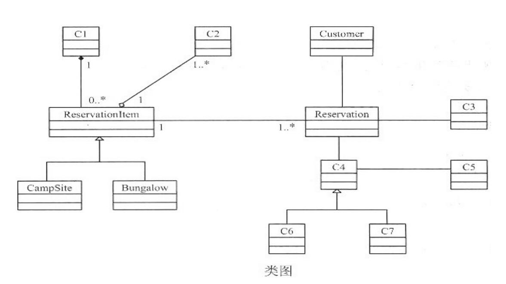

# 软件工程-q-000977

## 题目

试题三（共15分）
阅读下列说明和图，回答问题1至问题3．将解答填入答题纸的对应栏内。
【说明】
某城市的各国家公园周边建造了许多供游客租用的小木屋和营地，为此，该城市设置了一个中心售票处和若干个区域售票处。游客若想租用小木屋或营地，必须前往中心售票处进行预定并用现金支付全额费用。所有的预定操作全部由售票处的工作人员手工完成。现欲开发一信息系统，实现小木屋和营地的预定及管理功能，以取代手工操作。该系统的主要功能描述如下。
 1．管理预定申请。游客可以前往任何一个售票处提出预定申请。系统对来自各个售票处的预定申请进行统一管理。
 2．预定。预定操作包含登记游客预定信息、计算租赁费用、付费等步骤。
3．支付管理。游客付费时可以选择现金和信用卡付款两种方式。使用信用卡支付可以享受3%的折扣，现金支付没有折扣。
 4．游客取消预定。预定成功之后，游客可以在任何时间取消预定，但需支付赔偿金，剩余部分则退还给游客。赔偿金的计算规则是，在预定入住时间之前的48小时内取消，支付租赁费用10%的赔偿金；在预定入住时间之后取消，则支付租赁费用50%的赔偿金。
5．自动取消预定。如果遇到恶劣天气(如暴雨、山洪等)，系统会自动取消所有的预定，发布取消预定消息，全额退款。
6．信息查询。售票处工作人员查询小木屋和营地的预定情况和使用情况，以判断是否能够批准游客的预定申请。
现采用面向对象方法开发上述系统，得到如表1所示的用例列表和表2所示的类列表。对应的用例图和类图分别如图1和图2所示。
表1  用例列表

表2　类列表

【问题1】（6分）
根据说明中的描述与表1，给出图1用例图中UC1～UC6处所对应的用例名称。

