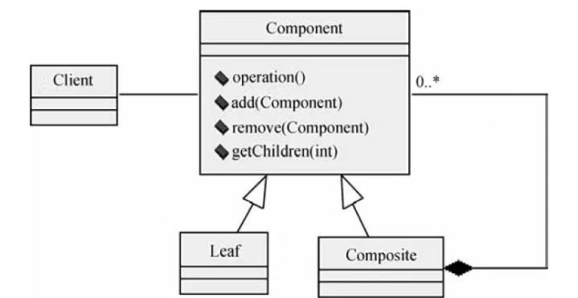

# 软件工程-q-000990

## 题目

设计模式中的（请作答此空）模式将对象组合成树形结构以表示“部分—整体”的层次结构，使得客户对单个对象和组合对象的使用具有一致性。下图为该模式的类图，其中，（2）定义有子部件的那些部件的行为；组合部件的对象由（3）通过 Component 提供的接口操作。

## 选项

- **A.** 代理（Proxy）

- **B.** 桥接器（Bridge）

- **C.** 组合（Composite）

- **D.** 装饰器（Decorator）

## 参考答案

- **C.** 组合（Composite）
