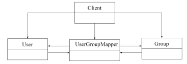

# 软件工程-q-000993

## 题目

在某系统中，不同组(Group)访问数据的权限不同，每个用户(User)可以是一个或多个组中的成员，每个组包含零个或多个用户。现要求在用户和组之间设计映射，将用户和组之间的关系由映射进行维护，得到如下所示的类图。该设计采用（请作答此空） 模式，用一个对象来封装系列的对象交互； 使用户对象和组对象不需要显式地相互引用，从而使其耦合松散，而且可以独立地改变它们之间的交互。该模式属于(45)模式，该模式适用于: (46)。

## 选项

- **A.** 状态(State)

- **B.** 策略(Strategy)

- **C.** 解释器(Interpreter)

- **D.** 中介者(Mediator)

## 参考答案

- **D.** 中介者(Mediator)
