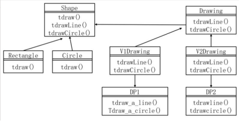

# 软件工程-q-001015

## 题目

欲开发一个绘图软件，要求使用不同的绘图程序绘制不同的图形，该绘图软件的扩展性要求将不断扩充新的图形和新的绘图程序，以绘制直线和图形为例，得到如下图所示的类图，该设计采用 （1） 模式将抽象部分与其实现部分分离，使它们都可以独立地变化。其中 （2） 定义了实现类接口，该模式适用于 （请作答此空） 的情况。

## 选项

- **A.** 不希望在抽象和它的实现部分之间有一个固定判定关系

- **B.** 想表示对象的部分-整体层次结构

- **C.** 想使用一个已经存在的类，而它的接口不符合要求

- **D.** 在不影响其他对象的情况下，以动态透明的方式给单个对象添加职责

## 参考答案

- **A.** 不希望在抽象和它的实现部分之间有一个固定判定关系
