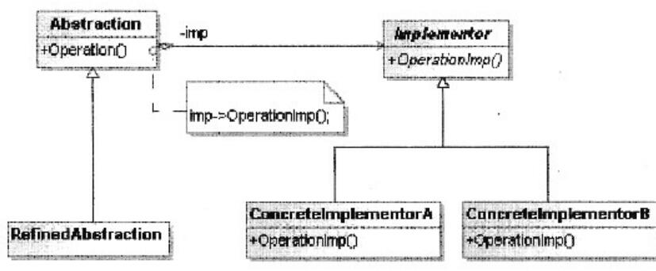

# 软件工程-q-001016

## 题目

设计模式（请作答此空）将抽象部分与其实现部分相分离，使它们都可以独立地变化。下图为该设计模式的类图，其中，（2）用于定义实现部分的接口。

## 选项

- **A.** Bridge(桥接)

- **B.** Composite(组合)

- **C.** Facade(外观)

- **D.** Singleton(单例)

## 参考答案

- **A.** Bridge(桥接)
