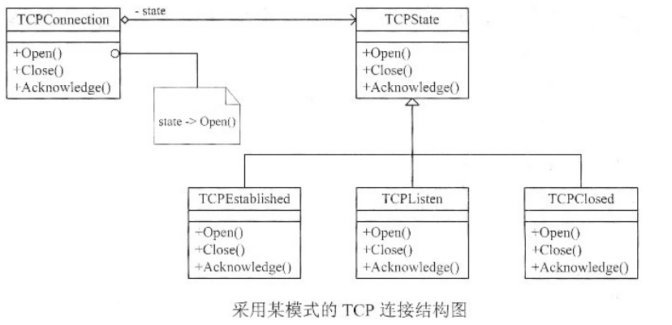

# 软件工程-q-001019

## 题目

每种设计模式都有特定的意图。（1）模式使得一个对象在其内部状态改变时通过调用另一个类中的方法改变其行为，使这个对象看起来如同修改了它的类。下图是采用该模式的有关TCP连接的结构图实例。该模式的核心思想是引入抽象类（请作答此空）来表示TCP连接的状态，声明不同操作状态的公共接口，其子类实现与特定状态相关的行为。当一个（3）对象收到其他对象的请求时，它根据自身的当前状态做出不同的反应。

## 选项

- **A.** TCPConnection

- **B.** state

- **C.** TCPState

- **D.** TCPEstablished

## 参考答案

- **C.** TCPState
