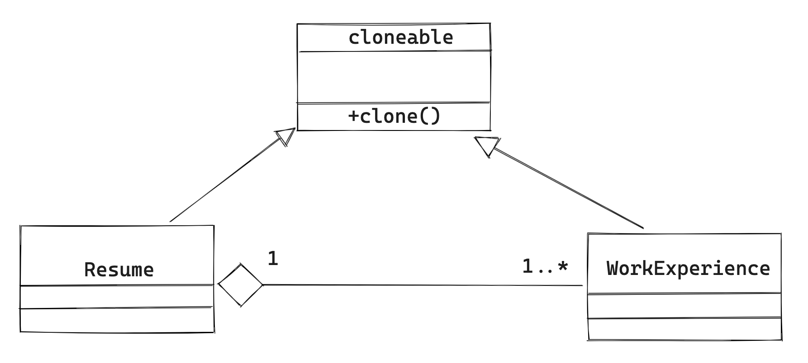

# 软件工程-q-001023

## 题目

44-45、在某招聘系统中，要求实现求职简历自动生成功能。简历的基本内容包括求职xx的姓名、性别、年龄及工作经历等。希望每份简历中的工作经历有所不同，并尽量减少xx序中的重复代码。针对此需求，设计如下所示类图。该设计采用了(44)模式，由 xx实例指定创建对象的种类，声明一个复制自身的接口，并且通过复制这些 Resume xx WorkExperience 的对象来创建新的对象。该模式属于（请作答此空）模式。

## 选项

- **A.** 混合型

- **B.** 行为型

- **C.** 结构型

- **D.** 创建型

## 参考答案

- **D.** 创建型
