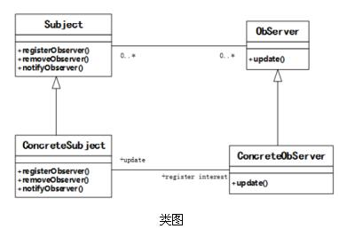

# 软件工程-q-001051

## 题目

试题六（15分）
阅读下列说明和JAVA代码，回答问题，将答案填入相应横线处。
【说明】
某实验室欲建立一个实验室环境监测系统，能够显示实验室的温度、湿度以及洁净度等环境数据。当获取到最新的环境测量数据时，显示的环境数据能够更新现在采用观察者(observer)模式来开发该系统，观察者模式的类图如下图所示。

【Java代码】

```java
import java.util.*;
interface Observer {
public void update(float temp, float humidity, float cleanness);
}
interface Subject {
public void registerObserver(Observer o); //注册对主题感兴趣的观察者
public void removeObserver(Observer o);   //删除观察者
   （1） ;             //当主题发生变化时通知观察者
}
class EnvironmentData  （2） Subject {
private ArrayList observers;
private float temperature, humidity, cleanness;
public EnvironmentData() {   observers = new ArrayList(); }
public void registerObserver(Observer o) { observers.add(o); }
public void removeObserver(Observer o)   { /* 代码省略 */ }
public void notifyObservers() {
    for (int i = 0; i < observers.size(); i++) {
        Observer observer = (Observer)observers.get(i);
    observer.update(temperature,humidity,cleanness);
    }
}
public void measurementsChanged() {notifyObservers(); }
public void setMeasurements(float temperature, float humidity, float cleanness) {
   （3）  ;
   （4）  ;
   （5）  ;
   measurementsChanged();
}
}
class CurrentConditionsDisplay implements Observer {
private float temperature;
private float humidity;
private float cleanness;
private Subject envData;
public CurrentConditionsDisplay(Subject envData) {
    this.envData = envData;
    envData.registerObserver(this);
}
public void update(float temperature, float humidity, float cleanness) {
    this.temperature = temperature;
    this.humidity = humidity;
    this.cleanness = cleanness;
    display();
}
public void display() {/* 代码省略 */ }
}
class EnvironmentMonitor{
public static void main(String args) {
    EnvironmentData envData = new EnvironmentData();
    CurrentConditionsDisplay currentDisplay = new CurrentConditionsDisplay(envData);
    envData.setMeasurements(80, 65, 30.4f);
}
}

```


