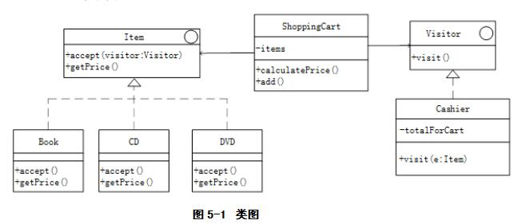

# 软件工程-q-001052

## 题目

试题五（共15分）
阅读下列说明和C++代码，填补代码中的空缺，将解答填入答题纸的对应栏内。
【说明 】
以下C++代码实现一个超市简单销售系统中的部分功能，顾客选择图书等物品（Item）加入购物车（ShoppingCart），到收银台（Cashier）对每个购物车中的物品统计其价格进行结账，设计如图5-1所示类图。

【C++代码】

```cpp
using namespace std;
class Book;
class Visitor {
public:
    virtual void visit(Book* book)=0;
    //其它物品的visit方法
};

class Item {
public:virtual void accept(Visitor* visitor)=0;
      virtual double getPrice()=0;
};
class Book （1） {
private:   double price;
public:
    Book (double price){ //访问本元素
              this->price = （2）;
    }
    void accept(Visitor* visitor) {
              （3）;
    }
    double getPrice() {     return price;     }
};
class Cashier（4） {
private:
    double totalForCart;
public:
    //访问Book类型对象的价格并累加
    （5）{
      //假设Book类型的物品价格超过10元打8折
      if(book->getPrice()<10.0) {
          totalForCart+=book->getPrice();
      } else
          totalForCart+=book->getPrice()*0.8;
    }
    //其它visit方法和折扣策略类似，此处略
    double getTotal() {
          return totalForCart;
    }
};
class ShoppingCart {
private:
    vector<Item*> items;
public:
    double calculatePrice() {
          Cashier* visitor=new Cashier();
          for(int i=0;i<items.size();i++)
                （6）;
          }
          double total=visitor->getTotal();
          return total;
    }
    void add(Item*e) {
          items.push_back(e);
    }
};

```


