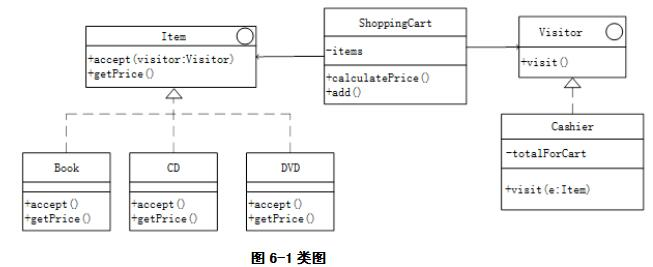

# 软件工程-q-001053

## 题目

试题六（共15分）
阅读以下说明和Java代码，填补代码中的空缺，将解答填入答题纸的对应栏内。
【说明】
以下Java代码实现一个超市简单销售系统中的部分功能，顾客选择图书等物件 (Item)加入购物车(ShoppingCart)，到收银台(Cashier)对每个购物车中的物品统计其价格进行结账。设计如图5-1所示类图。

【Java代码】

```java
interface Item{
  public void accept(Visitor visitor);
  public double getPrice();
}
class Book （1） {
  private double price;
  public Book(double price){（2）;}
  public void accept(Visitor visitor){   //访问本元素
      （3）;
  }
  public double getPrice() {
    return price;
  }
}
//其它物品类略
  interface Visitor {
    public void visit(Book book);
    //其它物品的visit方法
  }
  class Cashier（4）{
    private double totalForCart;
    //访问Book类型对象的价格并累加
    （5）{
      //假设Book类型的物品价格超过10元打8折
      if(book.getPrice()<10.0){
        totalForCart+=book.getPrice();
      } else
        totalForCart+=book.getPrice()*0.8;
  }
  //其它visit方法和折扣策略类似，此处略
  public double getTotal() {
    return totalForCart;
  }
}

class ShoppingCart {
  //normal shopping cart stuff
  private java.util.ArrayList<Item> items=new java.util.ArrayList<>();
  public double calculatePrice() {
      Cashier visitor=new Cashier();
      for(Item item:items) {
          （6）;
      }
      double total=visitor.getTotal();
      return total;
  }
  public void add(Item e) {
    this.items.add(e);
  }
}

```


