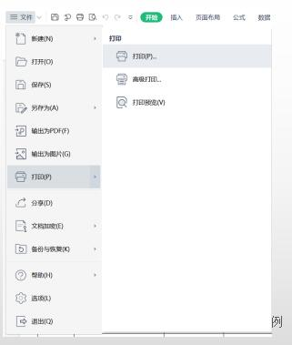
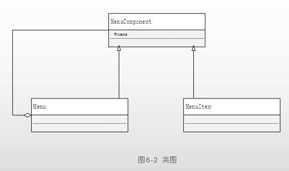
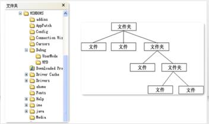
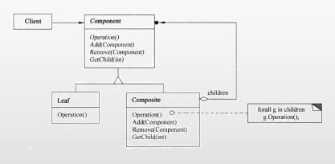
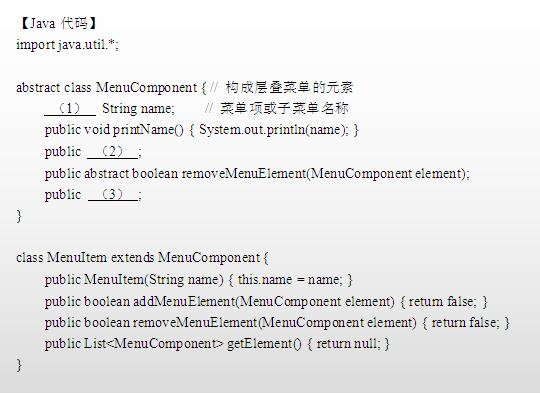
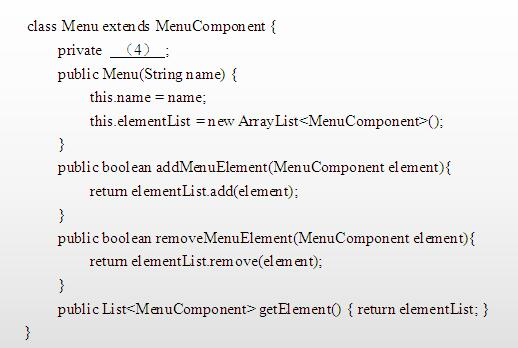
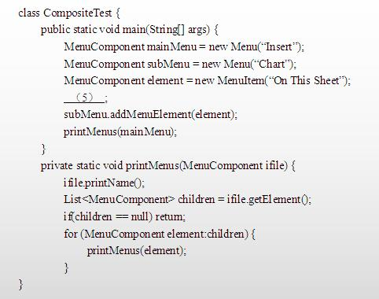

# 软件工程-q-001054

## 题目

案例六（15分）
阅读下列说明和Java代码，将应填入（n)处的字句写在答题纸的对应栏内。
【说明】
层叠菜单是窗口风格的软件系统中经常采用的一种系统功能组织方式。层叠菜单（如图6-1示例）中包含的可能是一个菜单项（直接对应某个功能），也可能是一个子菜单，现在采用组合（composite）设计模式实现层叠菜单，得到如图6-2所示的类图。

Composite组合模式：
将对象组合成树形结构以表示“部分-整体”的层次结构。Composite使得客户对单个对象和复合对象的使用具有一致性。
组合模式描述了如何将容器对象和叶子对象进行递归组合，使得用户在使用时无须对它们进行区分，可以一致地对待容器对象和叶子对象。

Composite组合模式：

