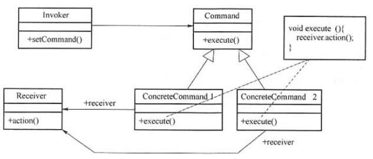

# 软件工程-q-001055

## 题目

试题五
阅读下列说明和C++代码，回答问题，将解答填入答题纸的对应栏内。
【说明】
某灯具厂商欲生产一个灯具遥控器，该遥控器具有7个可编程的插槽，每个插槽都有开关按钮，对应着一个不同的灯。利用该遥控器能够统一控制房间中该厂商所有品牌灯具的开关，现采用Command(命令)模式实现该遥控器的软件部分。Command模式的类图如下图所示。

【C++代码】

```cpp
class Light {
public:
  Light(string name) { /* 代码省略 */ }
  void on() { /* 代码省略 */ }    // 开灯
  void off() { /* 代码省略 */ }  // 关灯
};
class Command {
public:
     （1）;
};
class LightOnCommand:public Command { // 开灯命令
private:
  Light* light;
public:
  LightOnCommand(Light* light) {   （2）    ; }
  void execute() {     light->on()   ; }
};
class LightOffCommand:public Command { // 关灯命令
private:
  Light *light;
public:
  LightOffCommand(Light* light) { this->light=light; }
  void execute() {     light->off()   ; }
};
class RemoteControl{ // 遥控器
private:
  Command* onCommands[7];
  Command* offCommands[7];
public:
  RemoteControl() { /* 代码省略 */ }
  void setCommand(int slot, Command* onCommand, Command* offCommand) {
     onCommands[slot]  =    （3）    ;
      offCommands[slot]  =    （4）    ;
  }
  void onButtonWasPushed(int slot) {    onCommands[slot]->execute()    ; }
  void offButtonWasPushed(int slot) {     offCommands[slot]->execute()    ; }
};
int main() {
       （5）    ;
  Light* livingRoomLight=new Light("Living Room");
Light*kitchenLight=new Light("kitchen");
  LightOnCommand* livingRoomLightOn=new LightOnCommand(livingRoomLight);
  LightOffCommand* livingRoomLightOff=new LightOffCommand(livingRoomLight);
  LightOnCommand*kitchenLightOn=new LightOnCommand(kitchenLight);
  LightOffCommand* kitchenLightOff=new LightOffCommand(kitchenLight);
  remoteControl->setCommand(0, livingRoomLightOn, livingRoomLightOff);
  remoteControl->setCommand(1, kitchenLightOn, kitchenLightOff);
  remoteControl->onButtonWasPushed(0);
  remoteControl->offButtonWasPushed(0);
  remoteControl->onButtonWasPushed(1);
  remoteControl->offButtonWasPushed(1);
  /* 其余代码省略 */
  return 0;
}

```


