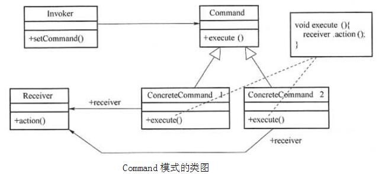

# 软件工程-q-001056

## 题目

试题六
阅读下列说明和JAVA代码，回答问题，将解答填入答题纸的对应栏内。
【说明】
某灯具厂商欲生产一个灯具遥控器，该遥控器具有7个可编程的插槽，每个插槽都有开关按钮，对应着一个不同的灯。利用该遥控器能够统一控制房间中该厂商所有品牌灯具的开关，现采用Command(命令)模式实现该遥控器的软件部分。Command模式的类图如下图所示。

Command模式的类图
【Java代码】
class Light {
  public Light() {}
  public Light(String name) { /*代码省略 */ }
  public void on()  { /* 代码省略*/ }    // 开灯
  public void off()  { /* 代码省略*/ }    // 关灯
  // 其余代码省略
}
interface Command {
      （1）   ;
}
class LightOnCommand implements Command { // 开灯命令
  Light light;
  public LightOnCommand(Light light) {    （2）   ; }
  public void execute() { light.on(); }
}
class LightOffCommand implements Command { // 关灯命令
  Light light;
  public LightOffCommand(Light light) { this.light=light; }
  public void execute(){light.off(); }
}
class RemoteControl { // 遥控器
  Command onCommands=new Command[7];
  Command offCommands=new Command[7];
  public RemoteControl() { /* 代码省略*/ }
  public void setCommand(int slot, Command onCommand, Command offCommand) {
   onCommands[slot]=    （3）    ;
   offCommands[slot]=     （4）    ;
  }
  public void onButtonWasPushed(int slot) {
   onCommands[slot].execute();
  }
  public void offButtonWasPushed(int slot){
   offCommands[slot].execute() ;
  }
}
class RemoteLoader {
  public static void main(String args) {
          （5）    ;
    Light livingRoomLight=new Light("Living Room");
    Light kitchenLight=new Light("kitchen");
    LightOnCommand livingRoomLightOn=new LightOnCommand(livingRoomLight);
    LightOffCommand livingRoomLightOff=new LightOffCommand(livingRoomLight);
    LightOnCommand kitchenLightOn=new LightOnCommand(kitchenLight);
    LightOffCommand kitchenLightOff=new LightOffCommand(kitchenLight);
    remoteControl.setCommand(0, livingRoomLightOn, livingRoomLightOff);
    remoteControl.setCommand(1, kitchenLightOn, kitchenLightOff);
    remoteControl.onButtonWasPushed(0);
    remoteControl.offButtonWasPushed(0);
    remoteControl.onButtonWasPushed(1);
    remoteControl.offButtonWasPushed(1);
  }
}

