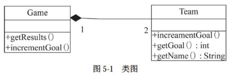

# 软件工程-q-001057

## 题目

试题五
【说明】
球类比赛记分系统中，每场有两支球队（Team）进行比赛（Game），分别记录各自的得分。图5-1所示为记分系统的类图。

【Java 代码】
class Team {
private String name;
private（1）;
public Team(String name){
（2）= name;
    }
void incrementGoal(){
（3）;
    }
int getGoals(){
return goals;
    }
String getName(){
return name;
}
};
class Game {
private Team a，b; //两支比赛球队
public Game(Team tl,Team t2){
a = tl;
b = t2;
    }
void getResults（）{ //输出比分
System.out.print(a.getName() + ":" + b.getName() + "= ");
System.out.println(a.getGoals() + ":" + b.getGoals());
}
void incrementGoal（（4）t）{ //球队t进1球
t.incrementGoal ();
}
void incrementGoal（（4）t）{ //球队t进1球
t.incrementGoal ();
}

public static void main(String...args){
Team tl = new Team("TA");
Team t2 = new Team("TB");
Game football =（5）;

football.incrementGoal(t1);
football.incrementGoal(t2);
football.getResults();           //输出为∶TA∶TB = 1∶1
football.incrementGoal(t2);
football.getResults();           //输出为∶TA∶TB = 1∶2
}
};

