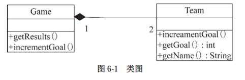
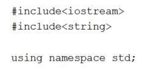

# 软件工程-q-001058

## 题目

试题六
【说明】
球类比赛记分系统中，每场有两支球队（Team）进行比赛（Game），分别记录各自的得分。图6-1所示为记分系统的类图。

【C++ 代码】

```cpp

#include<iostream>
#include<string>

using namespace std;

class Team {
private :
string name;
（1）;
public :
Team(string name){
（2）= name; goals = 0;
      }
void incrementGoal(){
（3）;
      }
int getGoals(){
return goals;
      }
string getName(){
return name;
}
};
class Game {
private:
Team *a, *b;       //两支比赛球队
public :
Game(Team *tl,Team* t2){
a = tl;
b = t2;
    }
void getResults(){             //输出比分
cout << a->getName() << ":" << b->getName() << " = ";
cout << a->getGoals() << ":" << b->getGoals() << endl;
}
void incrementGoal(（4）t) { //球队t进1球
t->incrementGoal ();
}
};
int main(){
Team *t1 = new Team("TA");
Team *t2 = new Team("TB");
Game *football =（5）;

football->incrementGoal(t1);
football->incrementGoal(t2);
football->getResults();           //输出为∶TA∶TB = 1∶1
football->incrementGoal(t2);
football->getResults();           //输出为∶TA∶TB = 1∶2

return 0;
}

```




