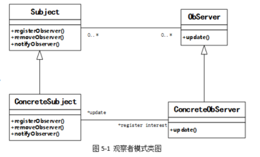

# 软件工程-q-001062

## 题目

试题五（共15分）
阅读下列说明和C++代码，将应填入 (n)处的字句写在答题纸的对应栏内。
【说明】 某实验室欲建立一个实验室环境监测系统，能够显示实验室的温度、湿度以及洁净度等环境数据。当获取到最新的环境测量数据时，显示的环境数据能够更新。 现在采用观察者(Observer)模式来开发该系统。观察者模式的类图如图5-1所示。

【C++代码】

```cpp
#include <iostream>
#include <vector>
using namespace std;
class Observer {
public:
virtual void update(float temp, float humidity, float cleanness)=0;
 };
class Subject {
public: virtual void registerObserver(Observer* o) = 0; //注册对主题感兴趣的观察者
virtual void removeObserver(Observer* o) = 0; //删除观察者
virtual void notifyObservers() = 0;//当主题发生变化时通知观察者
};
class EnvironmentData : public （1） {
private:
vector<Observer*> observers;
float temperature, humidity, cleanness;
public:
void registerObserver(Observer* o) { observers.push_back(o); }
void removeObserver(Observer* o) { /* 代码省略 */ }
void notifyObservers() {
 for(vector<Observer*>::const_iterator it = observers.begin();
it != observers.end(); it++)
{ （2） ; }
}
void measurementsChanged() { （3） ; }
void setMeasurements(float temperature, float humidity, float cleanness) {
this->temperature = temperature;
this->humidity = humidity;
this->cleanness = cleanness;
（4） ;
}
};
class CurrentConditionsDisplay : public Observer {
private:
float temperature, humidity, cleanness;
Subject* envData;
public:
CurrentConditionsDisplay(Subject* envData) {
this->envData = envData;
（6） ;
}
void update(float temperature, float humidity, float cleanness) {
this->temperature = temperature;
this->humidity = humidity;
this->cleanness = cleanness;
display();
}
void display() { /* 代码省略 */ }
};
int main() {
EnvironmentData* envData = new EnvironmentData();
CurrentConditionsDisplay* currentDisplay = new CurrentConditionsDisplay(envData); envData->setMeasurements(80, 65, 30.4f);
return 0;

```


