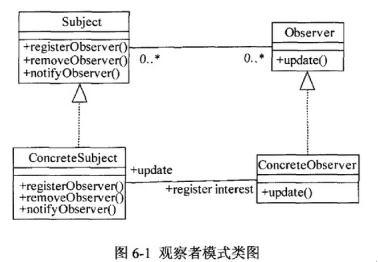

# 软件工程-q-001063

## 题目

试题六（共15分）
阅读下列说明和Java代码，将应填入 (n)处的字句写在答题纸的对应栏内。
【说明】 某实验室欲建立一个实验室环境监测系统，能够显示实验室的温度、湿度以及洁净度等环境数据。当获取到最新的环境测量数据时，显示的环境数据能够更新。 现在采用观察者(Observer)模式来开发该系统。观察者模式的类图如图6-1所示。

【Java代码】

```java
import java.util.*;
interface Observer {
  public void update(float temp, float humidity, float cleanness);
}
interface Subject {
  public void registerObserver(Observer o); //注册对主题感兴趣的观察者
  public void removeObserver(Observer o);  //删除观察者
  public void notifyObservers();            //当主题发生变化时通知观察者
}
class EnvironmentData implements    （1）    {
  private ArrayList observers;
  private float temperature, humidity, cleanness;
  public EnvironmentData() {  observers = new ArrayList(); }
  public void registerObserver(Observer o) { observers.add(o); }
  public void removeObserver(Observer o)  { /* 代码省略 */ }
  public void notifyObservers() {
    for (int i = 0; i < observers.size(); i++) {

      Observer observer = (Observer)observers.get(i);
        （2）   ;
    }
  }
  public void measurementsChanged() {   （3）  ; }
public void setMeasurements(float temperature, float humidity, float cleanness) {
    this.temperature = temperature;
    this.humidity = humidity;
    this.cleanness = cleanness;
      （4）  ;
  }
}

class CurrentConditionsDisplay implements    Observer     {
  private float temperature;
  private float humidity;
  private float cleanness;
  private Subject envData;
  public CurrentConditionsDisplay(Subject envData) {
    this.envData = envData;
      （6） ;
}

  public void update(float temperature, float humidity, float cleanness) {
    this.temperature = temperature;
    this.humidity = humidity;
    this.cleanness = cleanness;
    display();
}
  public void display() {/* 代码省略 */ }
}
class EnvironmentMonitor{
  public static void main(String args) {
    EnvironmentData envData = new EnvironmentData();
    CurrentConditionsDisplay currentDisplay = new CurrentConditionsDisplay(envData);
    envData.setMeasurements(80, 65, 30.4f);
  }

```


