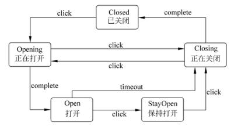

# 软件工程-q-001064

## 题目

试题五（15分）
阅读以下说明和C++代码，将应填入_（n）_处的字句写在答题纸的对应栏内。
【说明】
传输门是传输系统中的重要装置。传输门具有Open（打开）、Closed（关闭）、Opening （正在打开）、StayOpen（保持打开）和Closing（正在关闭）五种状态。触发传输门状态转换的事件有click、complete 和 timeout三种。事件与其相应的状态转换如下图所示。

下面的C++代码1与C++代码2分别用两种不同的设计思路对传输门进行状态模拟，，请填补代码中的空缺。
【C++代码1】
const int CLOSED = l;		const int OPENING = 2;
const int OPEN = 3;		const int CLOSING = 4;
const int STAYOPEN = 5;		//定义状态变量，用不同整数表示不同状态
class Door {
  private:
int state;				//传输门当前状态
void setState（int state）{ this->state = state;}			//设置当前状态
public:
Door ():state (CLOSED){};
void getState (){				//根据当前状态输出相应的字符串
switch (state){
case OPENING: cout<<"OPENING"<< endl;break;
case CLOSED: cout << "CLOSED"<< endl;  break;
case OPEN: cout << "OPEN"<< endl;		break;
case CLOSING: cout << "CLOSING" << endl; break;
case STAYOPEN:cout<<"STAYOPEN"<< endl;break;
}
  }

void click () {					//发生 click 事件时进行状态转换
if（  1  ）			setState (OPENING);
else if （  2  ）	    setState (CLOSING);
else if （  3 ）       	setState (STAYOPEN);
      }
void timeout (){     //发生timeout事件时进行状态转换
if (state == OPEN)   setState(CLOSING);
      }
void complete () {	/发生 complete 事件时进行状态转换
if (state == OPENING)   setState (OPEN);
else if(state == CLOSING) setState(CLOSED);
      }
}；
int main() {
Door aDoor;
aDoor.getState (); 	aDoor.click();   	aDoor.getState ();
aDoor.complete();  aDoor.getState();  aDoor.click();
aDoor.getState ();  aDoor.click();     aDoor.getState();  return 0

【C++代码2】
class Door {
public:
DoorState *CLOSED,*OPENING,*OPEN,*CLOSING,*STAYOPEN,*state;
Door();
virtual ～Door（）{……//释放申请的内存，此处代码省略};
void setState (DoorState *state){this->state = state;}
void getState (){
//此处代码省略，本方法输出状态字符串，
//例如，当前状态为CLOSED时，输出字符串为"CLOSED"
};
void click ();
void timeout ();
void complete ();
};
Door::Door (){
CLOSED = new DoorClosed (this);     OPENING= new DoorOpening (this);
OPEN = new DoorOpen(this);         CLOSING=new DoorClosing(this);
STAYOPEN = new DoorStayOpen(this); state = CLOSED;
    }
void Door::click(){ _(4)_; }
void Door::timeout (){ _(5)_; }
void Door::complete () { _(6)_; }

class DoorState 			//定义一个抽象的状态，它是所有状态类的基类
{
protected:Door *door;
public:
DoorState(Door *door){ this->door = door;}
virtual ～DoorState (void);
virtual void click(){}
virtual void complete(){}
virtual void timeout (){}
}；
class DoorClosed ∶public DoorState{//定义一个基本的Closed状态
public:
DoorClosed (Door *door):DoorState (door){}
virtual ～ DoorClosed (){}
void click ();
    }；
void DoorClosed::click(){（7）;}
// 其他状态类的定义与实现代码省略
int main(){
Door aDoor;
aDoor.getState(); aDoor.click(); aDoor.getState(); aDoor.complete();
aDoor.getState(); aDoor.timeout(); aDoor.getState();return 0;
    }

