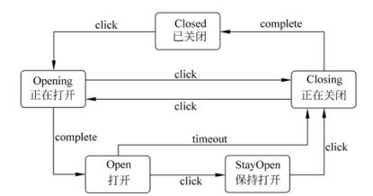

# 软件工程-q-001065

## 题目

试题六（15分）
阅读以下说明和java代码，将应填入_（n）_处的字句写在答题纸的对应栏内。
【说明】
传输门是传输系统中的重要装置。传输门具有Open（打开）、Closed（关闭）、Opening （正在打开）、StayOpen（保持打开）和Closing（正在关闭）五种状态。触发传输门状态转换的事件有click、complete 和 timeout三种。事件与其相应的状态转换如下图所示。

下面的java代码1与java代码2分别用两种不同的设计思路对传输门进行状态模拟，，请填补代码中的空缺。
【java代码1】

public class Door {
public static final int CLOSED= 1; public static final int OPENING =2;
public static final int OPEN = 3; public static final int CLOSING = 4;
public static final int STAYOPEN = 5; private int state = CLOSED;
//定义状态变量，用不同的整数表示不同状态

private void setState(int state){this.state =state;}
//设置传输门当前状态
public void getState (){
//此处代码省略，本方法输出状态字符串，
//例如，当前状态为 CLOSED时，输出字符串为"CLOSED"
    }
public void click（）{//发生click事件时进行状态转换
if（  1  ）      setState (OPENING);
else if （  2  ）  setState (CLOSING);)
else if （  3  ）  setState (STAYOPEN);
    }
//发生 timeout事件时进行状态转换
public void timeout(){ if(state == OPEN)    setState(CLOSING);}

public void complete（）{//发生 complete事件时进行状态转换
if(state == OPENING)      setState (OPEN);
else if (state == CLOSING)  setState(CLOSED);
    }
public static void main(String  args){
Door aDoor = new Door ();
aDoor,getState();aDoor.click();aDoor.getState(); aDoor.complete();
aDoor.getState(); aDoor.click(); aDoor.getState(); aDoor.click();
aDoor.getState ();   return;；
     }
 }

【Java 代码2】
public class Door {
public final DoorState CLOSED = new DoorClosed(this);
public final DoorState OPENING = new DoorOpening(this);
public final DoorState OPEN = new DoorOpen(this);
public final DoorState CLOSING = new DoorClosing(this);
public final DoorState STAYOPEN = new DoorStayOpen(this);
private DoorState state = CLOSED;

//设置传输门当前状态
public void setState(DoorState state){ this.state = state;)
public void getState（）{//根据当前状态输出对应的状态字符串
System.out.println(state.getClass ().getName ());
      }
public void click（）{ （4） ;}//发生 click 事件时进行状态转换
public void timeout (){ （5） ;}//发生 timeout 事件时进行状态转换
public void complete (){  (6)  ;}//发生 complete事件时进行状态转换

public static void main(String args){
Door aDoor = new Door ();
aDoor.getState();aDoor.click();aDoor.getState();aDoor.complete();
aDoor.getState(); aDoor.timeout(); aDoor.getState();return;
      }
 }
public abstract class DoorState {//定义所有状态类的基类
protected Door door ;
public DoorState(Door door){ this.door = door;}
public void click(){}
public void complete (){}
public void timeout (){}
 }
class DoorClosed extends DoorState{//定义一个基本的 Closed状态
public DoorClosed(Door door){ super(door);}
public void click(){  (7)  ;}
//该类定义的其余代码省略
}
//其余代码省略

