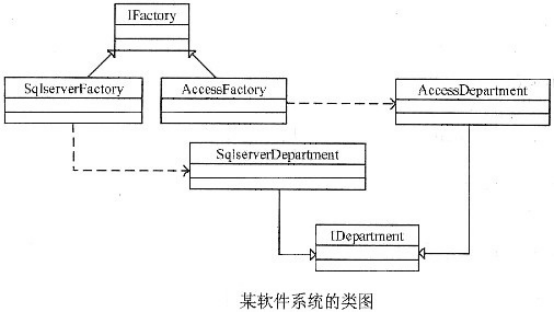

# 软件工程-q-001066

## 题目

试题五（共15分，每空3分）
阅读下列说明和C++代码，回答下列问题。
【说明】
  现欲开发一个软件系统，要求能够同时支持多种不同的数据库，为此采用抽象工厂模式设计该系统。以SQL Server和Access两种数据库以及系统中的数据库表Department为例，其类图如图5所示。

 [C++代码]
    #include<iostream>
    using namespace std;
    class Department{/*代码省略*/};
    class IDepartment{
    public:
        ___（1）___=0;
        ___（2）___=0;
    };
    class SqlServerDepartment: ___（3）___{
    public:
       void Insert(Department* department){
            cout<<"Insert a record into Department in SQL Server!\n";
            //其余代码省略
       }
       Department GetDepartment(int id){
       }
    };
    class AccessDepartment: public IDepartment {
    public:
        void Insert(Department* department){
             cout<<"Insert a record into Department in ACCESS!\n";
            //其余代码省略
       }
       Department GetDepartment(int id){
            /*代码省略*/
       }
    };
    ___（5）___{
    public:
    __（6）____=0;
    };
    class SqlServerFactory: public IFactory{
    public:
       IDepartment* CreateDepartment() {return new SqlServerDepartment(); }
    };
    class AccessFactory:public IFactory{
    public:
       IDepartment* CreateDepartment() {  return new AccessDepartment() ;  }
       //其余代码省略
    };

