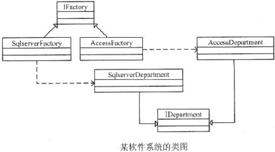

# 软件工程-q-001067

## 题目

试题六 （共15分，每空3分）
阅读下列说明和Java代码，回答下列问题。
【说明】
   现欲开发一个软件系统，要求能够同时支持多种不同的数据库，为此采用抽象工厂模式设计该系统。以SQLServer和Access两种数据库以及系统中的数据库表Department为例，其类图如图6所示。

【Java代码】
    import java.util.*;
    class Department{  /*代码省略* /  }
    interface IDepartment{
      ___（1）___;
       ___（2）___;
    }
    class SqlServerDepartment __（3）____{
         public void Insert(Department department){
                System.out.println("Insert a record into Department in SQL Server!");
                //其余代码省略
          }
          public Department GetDepartment(int id){
          }
    }
    class AccessDepartment implements IDepartment {
        public void Insert(Department department){
                 System.out.println("Insert a record into Department in ACCESS!");
                 //其余代码省略
        }
        public IDepartment GetDepartment(int id){
        }
    }

    class SqlServerFactory implements IFactory{
          public Department CreateDepartment(){
              return new SqlServerDepartment();
          }
          //其余代码省略
    }
    class AccessFactory implements IFactory{

____（5）__{
       __（6）____;
    }
         //其余代码省略
    }

