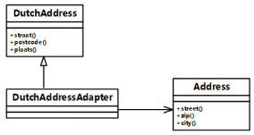

# 软件工程-q-001068

## 题目

试题五（15分）
阅读下列说明和C++代码，将应填入  （n）  处的字句写在答题纸的对应栏内。
【说明】
某软件系统中，已设计并实现了用于显示地址信息的类Address（如图5-1所示），现要求提供基于Dutch语言的地址信息显示接口。为了实现该要求并考虑到以后可能还会出现新的语言的接口，决定采用适配器（Adapter）模式实现该要求，得到如图5-1所示的类图。

图5-1  适配器模式类图
【C++代码】

```cpp

#include <iostream>
using namespace std;

class Address{
public:
    void street()  { /*  实现代码省略  */  }
    void zip()      { /*  实现代码省略  */  }
    void city()     { /*  实现代码省略  */  }
∥其他成员省略
};

class DutchAddress {
public:
    virtual void straat()=0;
    virtual void postcode()=0;
    virtual void plaats()=0;
//其他成员省略
};

class DutchAddressAdapter : public DutchAddress {
private:
    （1） ;
public:
    DutchAddressAdapter(Address *addr) {
        address = addr;
    }
    void straat() {
       （2） ;
    }
    void postcode(){
       （3） ;
    }
    void plaats(){
       （4） ;
    }
//其他成员省略
};

void testDutch(DutchAddress *addr){
       addr->straat();
       addr->postcode();
       addr->plaats();
}

int main(){
    Address*addr = new Address();
     （5） ;
    cout << "\nThe DutchAddress\n" << endl;
    testDutch(addrAdapter);
    return 0;
}

```


