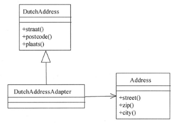

# 软件工程-q-001069

## 题目

试题六（15分）
阅读下列说明和Java代码，将应填入 （n） 处的字句写在答题纸的对应栏内。
【说明】
某软件系统中，已设计并实现了用于显示地址信息的类Address（如图6-1所示），现要求提供基于Dutch语言的地址信息显示接口。为了实现该要求并考虑到以后可能还会出现新的语言的接口，决定采用适配器（Adapter）模式实现该要求，得到如图6-1所示的类图。

图6-1  适配器模式类图
【Java代码】

import java.util.*;
class Address{
    public void street()   {    //实现代码省略   }
    public void zip()      {    //实现代码省略   }
    public void city()     {    //实现代码省略   }
∥其他成员省略
}

class DutchAddress{
    public void straat()    {    //实现代码省略   }
    public void postcode()  {    //实现代码省略   }
    public void plaats()    {    //实现代码省略   }
//其他成员省略
}

class DutchAddressAdapter extends DutchAddress {
    private  （1） ;

    public DutchAddressAdapter (Address addr){
        address= addr;
    }

    public void straat() {
       （2） ;
    }

    public void postcode() {
       （3） ;
    }

    public void plaats(){
       （4） ;
    }
//其他成员省略
}

class Test {
    public static void main(String args) {
        Address addr = new Address();
         （5） ;
        System.out.println("\nThe DutchAddress\n");
        testDutch(addrAdapter);
    }

    static void  testDutch(DutchAddress addr){
          addr.straat();
          addr.postcode();
          addr.plaats();
    }
}

