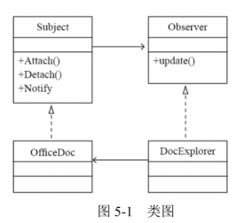
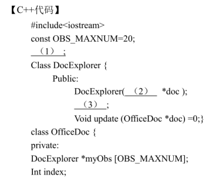
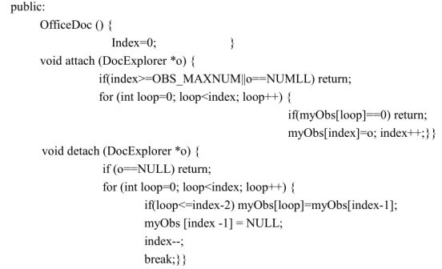

# 软件工程-q-001070

## 题目

试题五（15分）
阅读下列说明和C++代码，将应填入  （n）  处的字句写在答题纸的对应栏内。
【说明】
某文件管理系统中定义了类 OfficeDoc 和 DocExplorer。当类 OfficeDoc 发生变化时，类DocExplorer 的所有对象都要更新其自身的状态。现采用观察者（Observer）设计模式来实现该需求，所设计的类图如图 5-1 所示。

【C++代码】
#include<iostream>
#include<vector>
#include<string>
using namespace std;

class Observer{
public:
     （1） ;
};

class Subject {
protected:
    vector< （2） >myObs;
public:
    virtual void Attach(Observer *obs) {myObs.push_back(obs);}
virtual void Detach(Observer *obs) {
        for (vector<Observer*>::iterator iter = myObs.begin(); iter != myObs.end(); iter++) {
            if (*iter == obs) {myObs.erase(iter); return;}
        }
}
    virtual void Notify() {
        for (vector<Observer*>::iterator iter = myObs.begin(); iter != myObs.end(); iter++) {
             （3） ;
}
    }
    virtual int getStatus() = 0;
    virtual void setStatus(int status) = 0;
};

class OfficeDoc: public Subject {
private:
string mySubjectName;
int m_status;
public:
OfficeDoc(string name): mySubjectName(name), m_status (0) {}
void setStatus (int status) {m_status = status;}
int getStatus() {return m_status;}
};

class DocExplorer: public Observer{
private:
string myObsName;
public:
DocExplorer(string name, （4） sub): myObsName(name){sub-> （5） ;}
void update(){cout<< "update observer:" <<myObsName<<endl;}
};

int main() {
Subject *subjectA = new OfficeDoc("subject A");
Observer *observerA = new DocExplorer("observerA", subjectA);
subjecta->setStatus(1); subjecta->Notify();
return 0;
}

