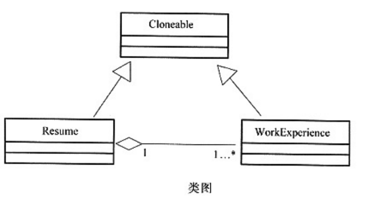

# 软件工程-q-001073

## 题目

试题五（共15分，每空3分）
阅读下列说明和C++代码，回答下列问题。
【说明】
 现要求实现一个能够自动生成求职简历的程序，简历的基本内容包括求职者的姓名、性别、年龄及工作经历。希望每份简历中的工作经历有所不同，并尽量减少程序中的重复代码。
    现采用原型模式(Prototype)来实现上述要求，得到如图1所示的类图。

[C++代码]

     # include<string>
    using namespace std;
    class Cloneable{
    public:
    ____(1) _,
    class WorkExperience:public Cloneable{    //经历
    private:
        string workDate;
        string company;
    public:
        Cloneable*Clone(){
    ____(2)__
    obj->workDate=this->workDate;
    obj->company=this->company;
    return obj;
        }
                                                       //其余代码省略
      };
    class Resume:public Cloneable{                     //简历
    private:
    string name; string sex; string age;
    WorkExperience*work;
    Resume(WorkExperience*work){
        this->work=___(3)
    public:
    Resume(string name){  /*实现省略*/  }
    void  SetPersonalInfo(string sex, string age){  /*实现省略*/  }
        void setWorkExperience(string   workDate,string company) {  /*实现省略*/  }
        Cloneable*Clone(){
    ____(4)_;
    obj->name=this->name;
    obj->sex=this->sex;
    obj->age=this->age;
    return obj;
        }
    };
    int main(){
    Resume*a=new Resume("张三");
    a->SetPersonalInfo("男", "29");
    a->SetWorkExperience("1998～2000", "XXX公司");
    Resume*b=___(5)___;
    b->SetWorkExperience("2001～2006","YYY公司");
    return 0;
    }

