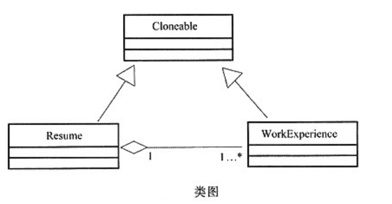

# 软件工程-q-001074

## 题目

试题六 （共15分，每空3分）
阅读下列说明和Java代码，回答下列问题。
【说明】
  现要求实现一个能够自动生成求职简历的程序，简历的基本内容包括求职者的姓名、性别、年龄及工作经历。希望每份简历中的工作经历有所不同，并尽量减少程序中的重复代码。
    现采用原型模式(Prototype)来实现上述要求，得到如图所示的类图。

【Java代码】
   class WorkExperience ___(1)  Cloneable{          //工作简历
            private String workDate;
            private String company;
            public Object Clone(){
                ___(2)__;
        obj.workDate=this.workDate;
        obj.company=this.company;
          return obj;
    }
    }
    class Resume implements Cloneable{                    //简历
          private  String name;
          private String sex;
          private String age;
          private WorkExperience work ;
          public Resume(String name){
            this.name=name;         work=new WorkExperience();
      }
            private Resume(WorkExperience work){
              this.work=__(3)_;
    }
            public void SetPersonalInfo( String  sex , String age) {  /*代码略*/  }
            public void SetWorkExperience(String workDate, String company) {  /*代码省略*/  }
            public Object Clone( ){
            Resume obj=__(4)_;
         //其余代码省略
         return obj;
    }
    }
    class WorkResume{
    public static void main(String  args){
            Resume  a=new  Resume("张三");
            a.SetPersonalInfo("男", "29");
            a.SetWorkExperience("1998～2000","XXX公司");
            Resume b= __(5)_;
            b.SetWorkExperience("2001～2006","YYY公司");
      }
    }

