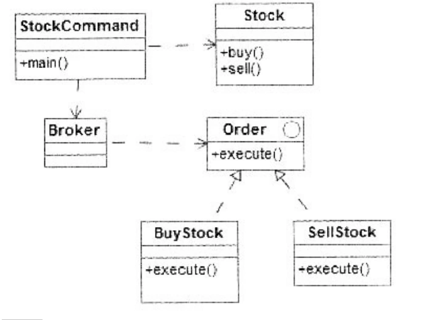

# 软件工程-q-001075

## 题目

试题五
阅读以下说明和C++代码，填补代码中的空缺，将解答填入答题纸的对应栏。
    [说明]
    在股票交易中，股票代理根据客户发出的股票操作指示进行股票的买卖操作。其类图如下图所示，相应的C++代码附后。

类图
    [C++代码]
    #include<iostream>
    #include<string>
    #include<vector>
    using namespace std;
    class Stock {
    private:
    string name;    int quantity;
    public:
    Stock(string name,int quantity) {this->name=name; this->quantity
    =quantity;}
    void buy() {cout<<"[买进]股票名称:"<<name<<",数量:"<<quantity<<
    endl;}
    void sell() {cout<<"[卖出]股票名称:"<<name<<",数量:"<<quantity
    <<endl;}
    };
    class order{
    public:
    virtual void execute()=0;
    };
    class BuyStock:___（1）___ {
    private:
    Stock* stock;
    public:
    BuyStock(Stock* stock){__（2）____ =stock;  }
    void execute(){    stock->buy();    }
    };
    //类SellStock的实现与BuyStock类似,此处略
    class Broker{
    private:
    vector<Order*> orderList;
    public:
    void takeOrder(___（3）___ order)(    orderList.push_back(order);}
    void placeOrders()  {
    for(int i=0;i<orderList.size(); i++){___（4）___ ->execute();}
    orderList.clear();
    }
    };
    class StockCommand{
    public:
    void main(){
    Stock* aStock=new Stock("股票A",10);
    Stock*bStock=new Stock("股票B",20);
    Order*buyStockOrder=new BuyStock(aStock);
    Order* sellStockOrder=new SellStock(bStock);
    Broker* broker=new Broker();
    broker->takeOrder(buyStockorder);
    broker->takeOrder(sellStockOrder);
    broker-> ___（5）___ ();
    }
    };
    int main(){
    StockCommand* stockCommand=new StockCommand();
    StockCommand->main();
    delete StoCkCommand;
    }

