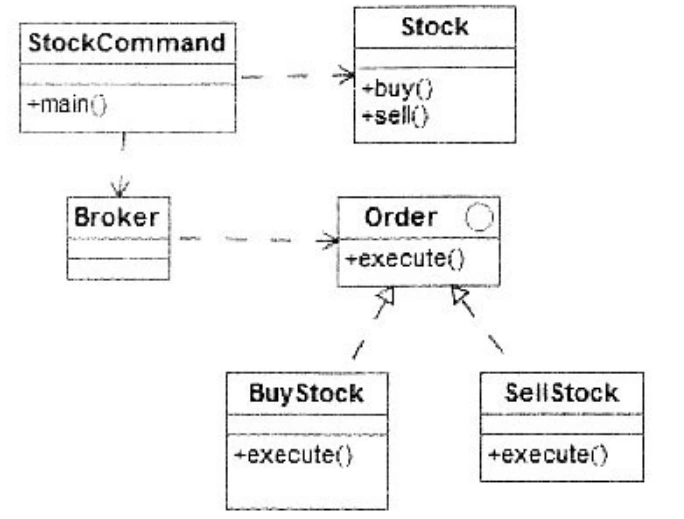

# 软件工程-q-001076

## 题目

试题六
阅读以下说明和Java代码，填补代码中的空缺，将解答填入答题纸的对应栏。
    [说明]
    在股票交易中，股票代理根据客户发出的股票操作指示进行股票的买卖操作。其类图如下图所示。相应的Java代码附后。

 类图
    [Java代码]
    import java.util.ArrayList;
    import java.util.List;
    class Stock{
    private String name;
    private int quantity;
    public Stock(String name,int quantity){
    thiS.name=name;this.quantity=quantity;
    }
    public void buy(){  System.out.println("[买进]:"+name+",数量:"
    +quantity);}
    public void sell() {System.out.println("[卖出]:"+name+",数量:"
    +quantity);}
    }
    interface Order {
    void execute();
    }
    class BuyStock __（1）____ Order {
    private Stock stock;
    public BuyStock(Stock stock){___（2）___=stock;  }
    public void execute(){    stock.buy();  }
    }
    //类SellStock实现和BuyStock类似,略
    class Broker{
    private List<Order>orderList=new ArrayList<Order>();
    public void takeOrder(__（3）____ order){  orderList.add(order);    }
    public void placeOrders(){
    for {_（4）_____ order:orderList) {order.execute();  }
    orderList.clear();
    }
    }
    public class StockCommand {
    public static void main(Stringargs){
    Stock aStock=new Stock("股票A",10);
    Stock bStock=new Stock("股票B",20);
    Order buyStockorder=new BuyStock(aStock);
    Order sellStockOrder=new SellStock(bStock);
    Broker broker=new Broker();
    broker.takeOrder(buyStockorder);
    broker.takeOrder(sellStockOrder);
    broker.__（5）____;
    }
    }

