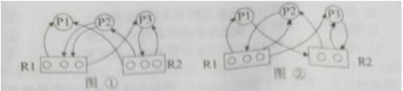

# 真题-q-001119

## 题目

假设系统中有三个进程 P1、P2 和 P3，两种资源 R1、R2。如果进程资源图如图①和图② 所示，那么（23）。

## 选项

- **A.** 图①和图②都可化简

- **B.** 图①和图②都不可化简

- **C.** 图①可化简，图②不可化简

- **D.** 图①不可化简，图②可化简

## 参考答案

- **C.** 图①可化简，图②不可化简
