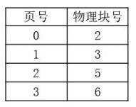

# 真题-q-001120

## 题目

假设计算机系统的页面大小为 4K，进程 P 的页面变换表如下表所示。若 P 要访问的逻辑

地址为十六进制 3C20H，那么该逻辑地址经过地址变换后，其物理地址应为（24）。

## 选项

- **A.** 2048H

- **B.** 3C20H

- **C.** 5C20H

- **D.** 6C20H

## 参考答案

- **D.** 6C20H
