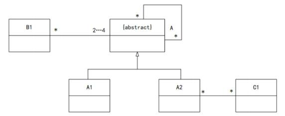

# 真题-q-001137

## 题目

某类图如图所示，下列选项错误的是（ ）。

## 选项

- **A.** 一个 A1 的对象可能与一个 A2 的对象关联

- **B.** 一个 A 的非直接对象可能与一个 A1 的对象关联

- **C.** 类 B1 的对象可能通过 A2 与 C1的对象关联

- **D.** 有可能 A 的直接对象与 B1 的对象关联

## 参考答案

- **D.** 有可能 A 的直接对象与 B1 的对象关联
