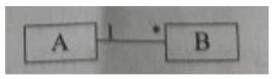

# 真题-q-001138

## 题目

UML 图中，对象图展现了（请作答此空），（2）所示对象图与下图所示类图不一致。

## 选项

- **A.** 一组对象、接口、协作和它们之间的关系

- **B.** 一组用例、参与者以及它们之间的关系

- **C.** 某一时刻一组对象以及它们之间的关系

- **D.** 以时间顺序组织的对象之间的交互活动

## 参考答案

- **C.** 某一时刻一组对象以及它们之间的关系
