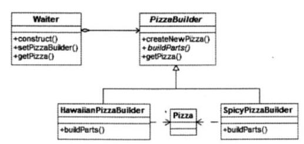

# 真题-q-001142

## 题目

某快餐厅主要制作并出售儿童套餐，一般包括主餐（各类比萨）、饮料和玩具，其餐品 种类可能不同，但制作过程相同。前台服务员（Waiter）调度厨师制作套餐。欲开发一软件， 实现该制作过程，设计如下所示类图。该设计采用（1）模式将一个复杂对象的构建与它的 表示分离，使得同样的构建过程可以创建不同的表示。其中，（2）构造一个使用 Builder 接口的对象。该模式属于（请作答此空）模式，该模式适用于（4）的情况。

## 选项

- **A.** 创建型对象

- **B.** 结构型对象

- **C.** 行为型对象

- **D.** 结构型类

## 参考答案

- **A.** 创建型对象
