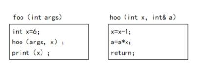

# 真题-q-001144

## 题目

函数 foo()、hoo()定义如下，调用函数 hoo()时，第一个参数采用传值（call by value）方式， 第二个参数采用传引用（call by reference）方式。设有函数调用 foo(5)，那么“print(x)”执 行后输出的值为（请作答此空）。

## 选项

- **A.** 24

- **B.** 25

- **C.** 30

- **D.** 36

## 参考答案

- **A.** 24
