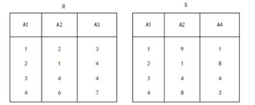

# 真题-q-001150

## 题目

关系 R、S 如下表所示，R ⋈S 的结果集为（请作答此空），R、S 的左外联接、右外联接和完全外 联接的元组个数分别为（2）。

## 选项

- **A.** { (2,1,4),(3,4,4) }

- **B.** { (2,1,4,8),(3,4,4,4) }

- **C.** { (C,1.4.2,1.8),(3.4,4.3,4,4) }

- **D.** { (1,2,3,1,9,1),(2,1,4,2,1,8),(3,4,4,3,4,4),(4,6,7.4,8,3) }

## 参考答案

- **B.** { (2,1,4,8),(3,4,4,4) }
