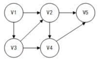

# 真题-q-001157

## 题目

某有向图如下所示，从顶点 v1 出发对其进行深度优先遍历，可能能得到的遍历序列是 （1）；从顶点 v1 出发对其进行广度优先遍历，可能得到的遍历序列是（请作答此空）。

①v1 v2 v3 v4 v5 ②v1 v3 v4 v5 v2 ③v1 v3 v2 v4 v5 ④v1 v2 v4 v5 v3

## 选项

- **A.** ①②

- **B.** ①③

- **C.** ②③

- **D.** ③④

## 参考答案

- **B.** ①③
