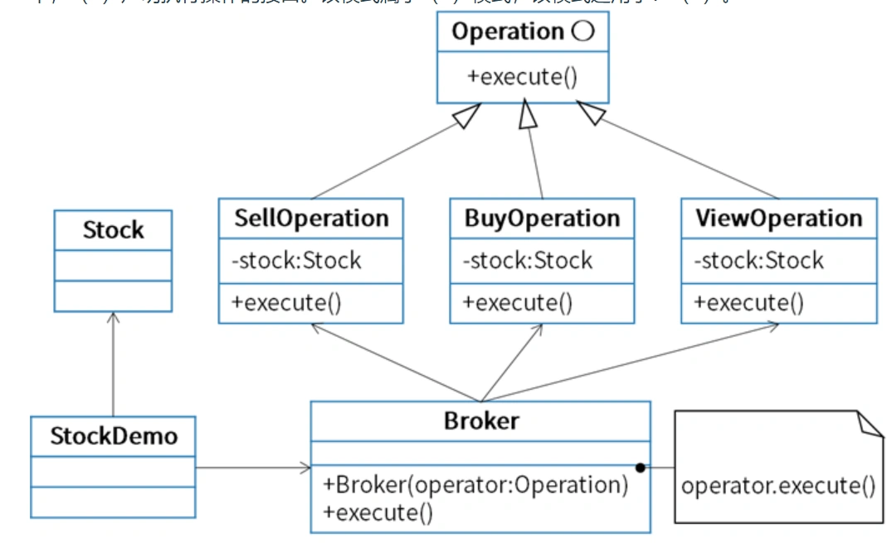

# 真题-q-001214

## 题目

股票交易中，股票代理(Broker) 根据客户发出的股票操作指示进行股票的买卖操作，设计如下所示类图。该设计采用(44)模式将一个请求封装为一个对象，从而使得以用不同的请求对客户进行参数化；对请求排队或记录请求日志，以及支持可撤销的操作，其中，(45)声明执行操作的接口。该模式属于(46)模式，该模式适用于：（请作答此空）_。

## 选项

- **A.** 一个对象必须通知其他对象，而它又不能假定其他对象是谁

- **B.** 抽象出待执行的动作以参数化某对象

- **C.** 一个对象的行为决定于其状态且必须在运行时刻根据状态改变行为

- **D.** 一个对象引用其他对象并且直接与这些对象通信而导致难以复用该对象

## 参考答案

- **B.** 抽象出待执行的动作以参数化某对象
