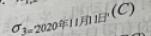
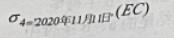
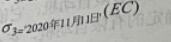

# 真题-q-001217

## 题目

某销售公司员工关系E（工号、姓名、部门名、电话、住址），商品关系C（商品号、商品名、库存数）和销售关系EC（工号、商品号、销售数、销售日期）。查询“销售部1”在2020年11月11日销售“HUAWEI Mate40”商品的员工工号、姓名、部门名及其销售的商品名，销售数的关系代数表达式为

## 选项

- **A.** σ4='2020年11月11日'(C)

- **B.** 

- **C.** 

- **D.** 

## 参考答案

- **C.** 
