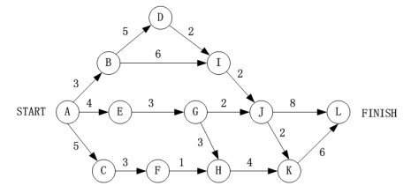

# 真题-q-001221

## 题目

下图是一个软件项目的活动图，其中顶点表示项目里程碑，连接顶点的边表示活动，边上的权重表示完成该活动所需要的时间(天)，则活动（请作答此空）不在关键路径上。活动BI和EG的松弛时间分别是(2)。

## 选项

- **A.** BD

- **B.** BI

- **C.** GH

- **D.** KL

## 参考答案

- **B.** BI
